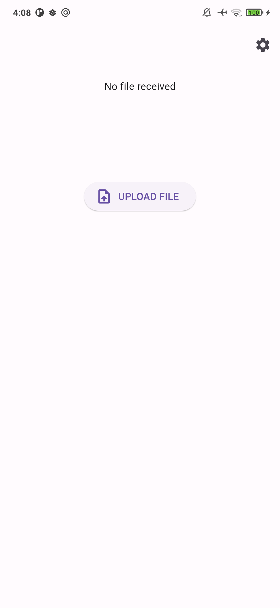
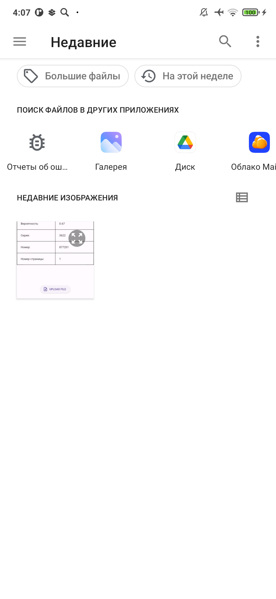
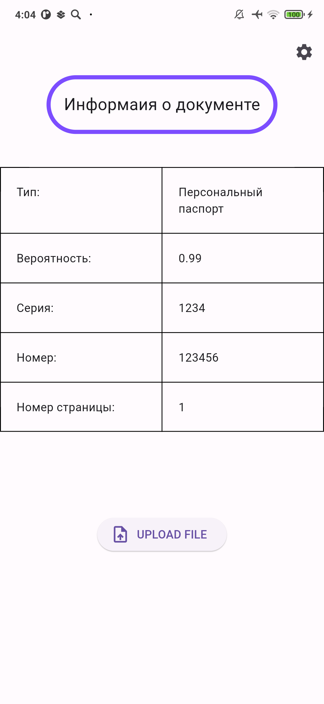

# Merc
Репозиторий проекта "API для определения типа и атрибутов документа по скану"

## Bash:

```bash
cd API
docker-compose up -d --build
```

## Run service:

```bash
docker-compose run api
```


## APK-file:

`.apk` файл лежит в директории `release` проекта.


## Итоговый вид Android приложения:


### Первый вход в приложение


### Выбор изображения


### Вывод результата



