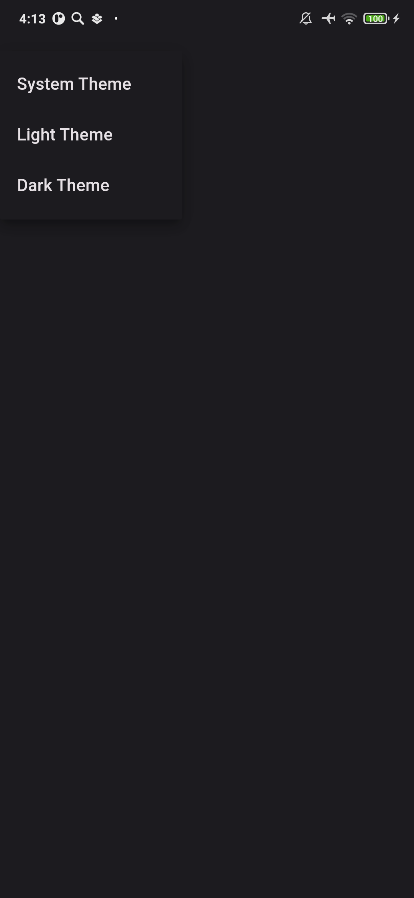

# Merc
Репозиторий проекта "API для определения типа и атрибутов документа по скану"
## Запуск

```bash
python -m venv venv
source ./venv/bin/activate
pip install -r requirements.txt
sudo apt update
sudo apt install tesseract-ocr-rus
cd API/app
uvicorn main:app --reload --workers 1 --host 192.168.1.5 --port 8000
```


## Bash:

```bash
cd API
docker-compose up -d --build
```

## Run service:

```bash
docker-compose run api
```


## APK-file:

`.apk` файл лежит в директории `release` проекта.


## Итоговый вид Android приложения:


### Первый вход в приложение


### Выбор изображения


### Вывод результата


### Выбор темы приложения

